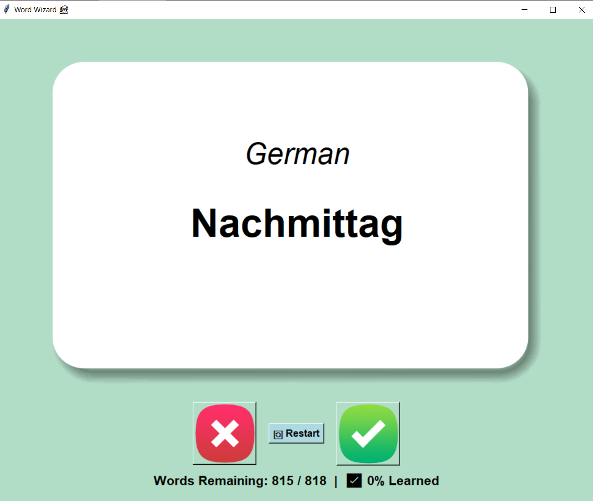

# 🇩🇪 Flash Card - German Vocabulary Trainer

This is a simple flash card application built with Python and Tkinter to help users learn German vocabulary.

## 🚀 Features

- Learn German words with flash cards
- Words automatically flip after a short delay
- Track your progress — known words are removed from the pool
- Restart learning with a single click
- Automatically saves progress locally
- Ready-to-use `.exe` version included for Windows

## 📦 Installation

1. Download the `.exe` file from the [Releases](https://github.com/ariatest/Flashcard-repo/releases/tag/v1.0.0) page.
2. Make sure to place `words_to_learn.csv` in the **same folder** as the `.exe` file.
3. Then run the application by double-clicking on the `.exe`.

> ⚠️ The app won't work properly if `words_to_learn.csv` is missing or placed elsewhere.

## 🛡 License

This project is provided for **personal and educational use only**.  
Commercial use, redistribution, or publishing any part of the code without permission is **strictly prohibited**.

For other use cases, please contact the author.
